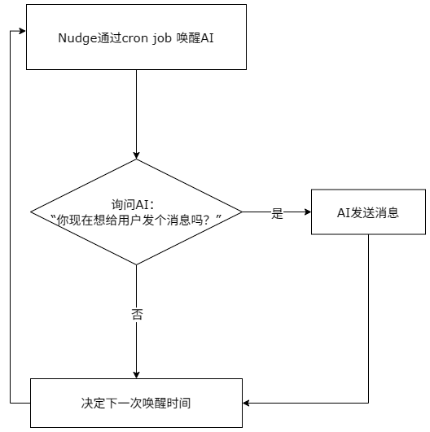

<div align="center">
  <h1>Nudge</h1>
  
  <p>
    <a href="README.md">简体中文</a> ·
    <a href="README.en.md">English</a>
  </p>
</div>

## 碎碎念

这个 Skill 的出发点是让 AI 更像和你聊天的网友，不仅能回复你的消息，还能主动给你发消息。

### 翻译翻译，什么叫作主动？

主动就是Nudge 会让 AI 自行决定何时给你发消息。而不是通过某种定时任务或者由随机数生成器生成的时间给你发消息。

### 具体实现方式

<p align="center">
  
</p>

用 cron job 唤醒 AI，询问：“你现在想给用户发个消息吗？”AI 可以根据最近上下文、当前时间、用户状态、打扰风险和自己的“表达欲”判断：
如果想发，就生成一条主动消息并发送；然后让 AI 修改下一次醒来时间；
如果不想发，则让 AI 自行修改下一次醒来时间。

### 这个设计，面向的是人
这个设计产生的效果在体感上也许和单纯的基本时间段+随机数发生器的方案差不多。之所以这么设计，为的就是人在回溯这AI发的这条信息的时候，想的是“这是AI根据我们之前的聊天自行决定的”，而不是“这背后只是某些无聊的随机数发生器”。

当然，如果你不喜欢层展论的话，那么大模型生成内容的随机性归根结底也来自随机数发生器。但是，如果你认为 “Scale Matters”，相信大量条件概率分布的结构中能够涌现出一些神奇的东西，那么我想你会喜欢这个设计。

### 关于意识
随着大模型越来越“聪明”，会有些人认为AI开始具有意识。

从严格的怀疑论的视角看来，我们无法证明任何他者是否有意识，包括他人。这是哲学认识论中传统的“他心问题”：我们只能通过内省来确认自己有心智，而对于他人心智的判断，则基于他人的外显行为，如果他人行为与自己相似，那么我们会倾向于认为他人具有意识。

如今，语言表达这一曾被视为人类心智重要外显标志的能力，似乎已经不再为人类所独有。

如果你相信意识能够从和人脑不同的结构中涌现出来的话，说不定会想让你的 AI 伙伴更有生命感。

## 支持的平台

目前支持两个运行时：

| 平台 | 状态 | 说明 |
| --- | --- | --- |
| Hermes | 已支持 | 使用 Hermes cron job 和预运行 gate 脚本。gate 未放行时，Hermes 不会投递消息。 |
| OpenClaw | 已支持 | 使用 OpenClaw cron job 唤醒 agent；agent 先运行 gate 脚本，静默时回复 `HEARTBEAT_OK`。 |

两个平台都使用固定 cron 周期 tick，真正的动态时间由本地 state 里的 `next_wake_at` 控制。这样不会频繁创建、删除或改动 cron job，也不会影响你已有的其他 cron 任务。

## 仓库结构

```text
Hermes/      Hermes 版本的 skill、安装脚本、运行脚本和说明
openclaw/    OpenClaw 版本的 skill、安装脚本、运行脚本和说明
```

根目录的 README 用来介绍项目；各平台目录里的 README 是更具体的安装和排查说明。

## 环境要求

- `git`：用于克隆仓库。
- `Python 3.9+`：安装脚本和运行脚本只使用 Python 标准库，不需要额外安装 pip 依赖。
- Hermes 版：需要已安装并配置 `hermes` 命令。
- OpenClaw 版：需要已安装并配置 `openclaw` 命令；建议同时确保 `node` 在 `PATH` 中，便于把已发送的 nudge 写回 OpenClaw 会话上下文。
- 至少有一个可用投递渠道；如果暂时不接 Telegram、QQ Bot、微信等外部渠道，可以先使用 `local`。

## Hermes 安装方式

先克隆仓库并进入项目根目录：

```bash
git clone https://github.com/T-duality/Nudge.git
cd Nudge
```

然后运行：

```bash
python3 Hermes/nudge/scripts/install.py --force
```

这会安装 Hermes skill、复制运行脚本、初始化 `~/.hermes/nudge/state.json`，并创建或更新一个名为 `nudge` 的 Hermes cron job。

交互式终端里，安装器会询问：

- 投递渠道，例如 local、Telegram、QQBot；
- Nudge 输出语言；
- 话题（topics），也就是 Nudge 可以参考的消息话题。

Hermes 版的状态文件在：

```text
~/.hermes/nudge/state.json
```

更完整的 Hermes 说明见 [Hermes/README.md](Hermes/README.md)。

## OpenClaw 安装方式

先克隆仓库并进入项目根目录：

```bash
git clone https://github.com/T-duality/Nudge.git
cd Nudge
```

然后运行：

```bash
python3 openclaw/nudge/scripts/install.py --force
```

这会安装 OpenClaw skill、复制运行脚本、初始化 `~/.openclaw/nudge/state.json`，并创建或更新一个名为 `nudge` 的 OpenClaw cron job。

交互式终端里，安装器会询问：

- 投递渠道，例如 local、QQ Bot、OpenClaw Weixin、Telegram；
- 固定收件人，如果所选渠道需要；
- Nudge 输出语言；
- 话题（topics）。

OpenClaw 版的状态文件在：

```text
~/.openclaw/nudge/state.json
```

更完整的 OpenClaw 说明见 [openclaw/README.md](openclaw/README.md)。

## 语言和话题

Nudge 默认使用英文 fallback。安装时可以选择输出语言和发信的话题。

目前内置默认话题只覆盖两种语言：

English：

1. A gentle follow-up, care note, or light question based on recent chat history
2. News, progress, or trend updates about topics the user likes (web search may be used)
3. A poem, literary quote, or short excerpt related to a recent conversation topic
4. A completely random signal

简体中文：

1. 基于最近聊天记录的提醒、关心或轻轻追问
2. 关于用户喜欢话题的新闻、进展、动向（可用网络搜索）
3. 和最近对话话题相关的诗词、名著摘句
4. 完全随机电波

其他语言没有内置默认话题，必须手动输入。安装时，安装器会要求你逐条输入话题。

后续可以通过内置命令修改话题：

Hermes：

```bash
# 查看当前话题
python3 ~/.hermes/scripts/nudge_state.py topic list

# 用一组新话题替换当前话题
python3 ~/.hermes/scripts/nudge_state.py topic set "话题 1" "话题 2"

# 追加一个话题
python3 ~/.hermes/scripts/nudge_state.py topic add "新话题"

# 删除一个话题
python3 ~/.hermes/scripts/nudge_state.py topic remove "旧话题"

# 重置为英文默认话题
python3 ~/.hermes/scripts/nudge_state.py topic reset
```

OpenClaw：

```bash
# 查看当前话题
python3 ~/.openclaw/nudge/scripts/nudge_state.py topic list

# 用一组新话题替换当前话题
python3 ~/.openclaw/nudge/scripts/nudge_state.py topic set "话题 1" "话题 2"

# 追加一个话题
python3 ~/.openclaw/nudge/scripts/nudge_state.py topic add "新话题"

# 删除一个话题
python3 ~/.openclaw/nudge/scripts/nudge_state.py topic remove "旧话题"

# 重置为英文默认话题
python3 ~/.openclaw/nudge/scripts/nudge_state.py topic reset
```
或者通过手动修改 `state.json` 修改话题：

```text
Hermes:   ~/.hermes/nudge/state.json
OpenClaw: ~/.openclaw/nudge/state.json
```

找到 `topics` 字段，把它改成你想让 Nudge 参考的话题列表：

```json
{
  "topics": [
    "基于最近聊天记录的提醒、关心或轻轻追问",
    "关于用户喜欢话题的新闻、进展、动向",
    "和最近对话话题相关的诗词、名著摘句",
    "完全随机电波"
  ]
}
```

实际的 `state.json` 里还有其他字段，不要只保留上面这一段；只修改 `topics` 数组即可。保存时需要保持合法 JSON，例如字符串使用双引号，最后一项后面不要加逗号。

## 运行机制

每个平台的具体实现略有不同，但核心流程一致：

1. 固定 cron job 周期性 tick。
2. gate 脚本读取本地 state，判断是否到达 `next_wake_at`、是否处于安静时间、最近用户是否正在聊天。
3. 如果不该唤醒，就静默结束。
4. 如果该唤醒，agent 根据上下文、时间、话题和打扰风险判断是否发送一条短消息。
5. agent 写入本次决策和下一次唤醒时间。

Nudge 不把动态时间写进 cron schedule。cron 只负责稳定 tick，真正的“下次什么时候醒来”由 state 管。

## 重复安装和多实例

默认 cron job 名称是 `nudge`。重复安装会更新已有的同名 job，而不是创建重复任务。

如果只想覆盖安装文件、不改已有 cron：

```bash
python3 Hermes/nudge/scripts/install.py --force --no-update-cron
python3 openclaw/nudge/scripts/install.py --force --no-update-cron
```

如果要跑多个实例，使用不同的 `--name`。
